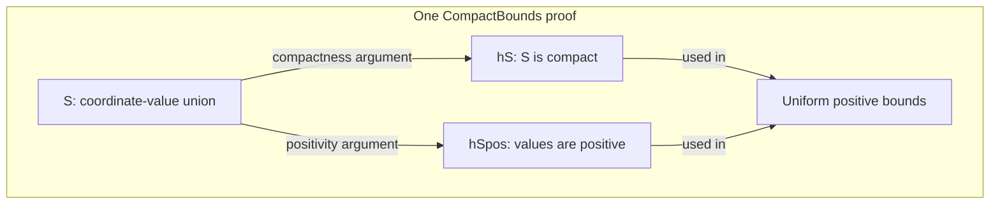
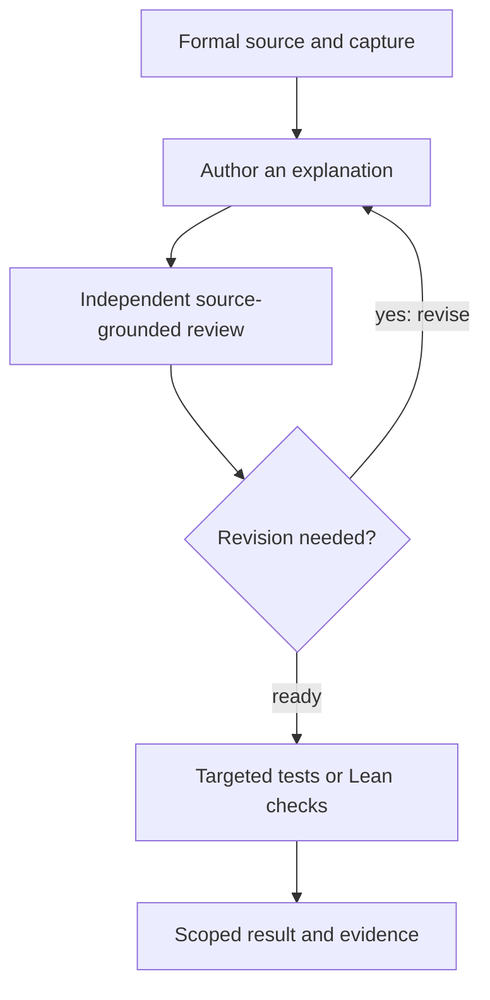

<!-- SPDX-License-Identifier: Apache-2.0 -->
# Xylem: Segmentation of and relationships between theoretical concepts

## Purpose

Xylem helps an individual person or agent inspect a mathematical proof. It makes the named pieces, their dependencies, and their supporting records easy to find. It provides a route from a well-posed question to an exact statement and provides the evidence needed to support and analyze it.

## Small steps for all 🚀

The pivotal realization is that Lean is a programming language and, as such, the modularity of code should simplify it. As a codebase, it has underlying structure. To change a function in code, one needs its inputs, what it calls, where it is used, and what it is intended to do—the real-world function. A large formal proof presents very similar issues. Xylem supplies the index and navigation tools for that problem. The mathematical argument is already there; the xylem provides the internal structure and relates the concepts together, creating a graph which links those discrete modules. Tree-sitter parses source code into concrete syntax trees; see the [Tree-sitter documentation](https://tree-sitter.github.io/tree-sitter/).

This release is rushed, as the recent OpenAI proof corpus is earth-shaking and requires an immediate response. It is very much a work in progress and much of the following prose is generated. While I will work with my agents going forward to improve it, my focus is on robotics—risk-aware planning and control with modular formal verification and compositional assurance, i.e., those assumptions, guarantees, and exclusions formally specified at interfaces between the components that comprise a robotic control system. We have included a [long list of teaching materials](TEACHING-RESOURCES.md), which we exhort readers to use with their own agents to improve and build on this system.



**High-level simplification:** this authored source map uses boxes for named facts and the conclusion, and arrows for how the proof uses them. Xylem supports this kind of inspection over captured declarations and relationships.

## Installation and Use

1. **Read the mathematics first, with no installation.** Start with [CompactBounds: one bound for every positive coordinate](xylem-plugin/examples/compact-bounds/explanation-hS.md), [a damped point mass returning to zero](xylem-plugin/examples/ctrllib-e2e/vault/PointMassComFlow.md), or the [Ctrllib mechanics and passivity reading path](TEACHING-RESOURCES.md#ctrllib-mechanics-and-passivity). Each explanation connects the equations to named source facts.
2. **Ask the graph a concrete question.** For the point-mass example, follow the convergence theorem to the mass-inverse fact it uses. From the copied package root:

```sh
cd xylem-plugin
python3.12 -m venv .venv
.venv/bin/python -m pip install -r canonical/requirements.txt
PYTHON="$PWD/.venv/bin/python"
CFG=examples/ctrllib-e2e/xylem-e2e-config.json
"$PYTHON" canonical/run.py --config "$CFG" build
"$PYTHON" canonical/run.py --config "$CFG" convert render-statement \
  --declaration Ctrllib.pointMass_tendsto_zero --json
"$PYTHON" canonical/run.py --config "$CFG" query path \
  Ctrllib.pointMass_tendsto_zero Ctrllib.pmM_inv --json
```

The statement view retains all seven binders. The path connects `Ctrllib.pointMass_tendsto_zero` with `Ctrllib.pmM_inv`. This selected fixture reports partial coverage and `fresh: false`; its [example guide](xylem-plugin/examples/ctrllib-e2e/README.md) explains the result and provides more CLI and MCP queries.

## From source to a checked explanation



**High-level simplification:** the supplied skills guide the author/reviewer loop, and tools produce targeted test or Lean evidence for the claim being checked. Review assesses the explanation; formal checks assess Lean obligations.

## Dedication


In memory of Margaret Hamilton, whose hard work helped make the first giant leap possible. We hope to honour her with another.

Photograph: MIT Instrumentation Laboratory (now Draper Laboratory), 1969. Public domain in the United States. [Photo sources and rights](assets/NOTICE.md).

As we wade through the semantic mud of what it all means, many deep thinkers will expound upon the question of "is all this necessary?" Indeed, Bastounis, Circelli and Hansen's [*Navier–Stokes lost in translation*](https://arxiv.org/html/2610.08144v1) offers a reason for Halting. For the pragmatic purposes of engineering, it is sufficient to refer to a fundamental truth of computing and probability: "Garbage in, garbage out." It is my hope that we are just Starting, and that our next leap may be as giant as that of those upon whose shoulders we stand.

## Explore further

Find related mathematics in the [Ctrllib subject index](ctrllib/SUBJECT-INDEX.md) and [rover geometry, motion, timing, and clearance guide](ctrllib/ROVER-PROVISIONAL.md). To regenerate the full 123-module graph, follow [public dependency provisioning](xylem-plugin/examples/ctrllib-e2e/BOOTSTRAP-PUBLIC-MACOS.md) and [full regeneration](xylem-plugin/examples/ctrllib-e2e/REGENERATE-FULL.md).

For teaching-oriented starting points and planned work, see [Mathematics learning and teaching resources](TEACHING-RESOURCES.md) and [Future directions](FUTURE-DIRECTIONS.md).

For the private percolation candidate, start with the [percolation capture and index guide](xylem-plugin/examples/percolation-e2e/README.md) and [integration provenance](provenance/PERCOLATION-INTEGRATION.md). The guide begins with the committed capture and query commands; source rebuilding remains a separately scoped, dependency-downloading operation.

For a bounded, source-inspected Navier–Stokes assurance case, read the [Navier–Stokes inverse-estimate semantic map](xylem-plugin/examples/navier-stokes/navier-stokes-semantic-map.md) and its [machine-readable evidence map](xylem-plugin/examples/navier-stokes/navier-stokes-semantic-map.json).

[Verification and technical scope](RELEASE-SCOPE.md) distinguish the compact examples, full source-first results, and the checks performed. Source credits and licenses are in [Ctrllib notices](ctrllib/NOTICE.md) and [Xylem notices](xylem-plugin/NOTICE.md).
